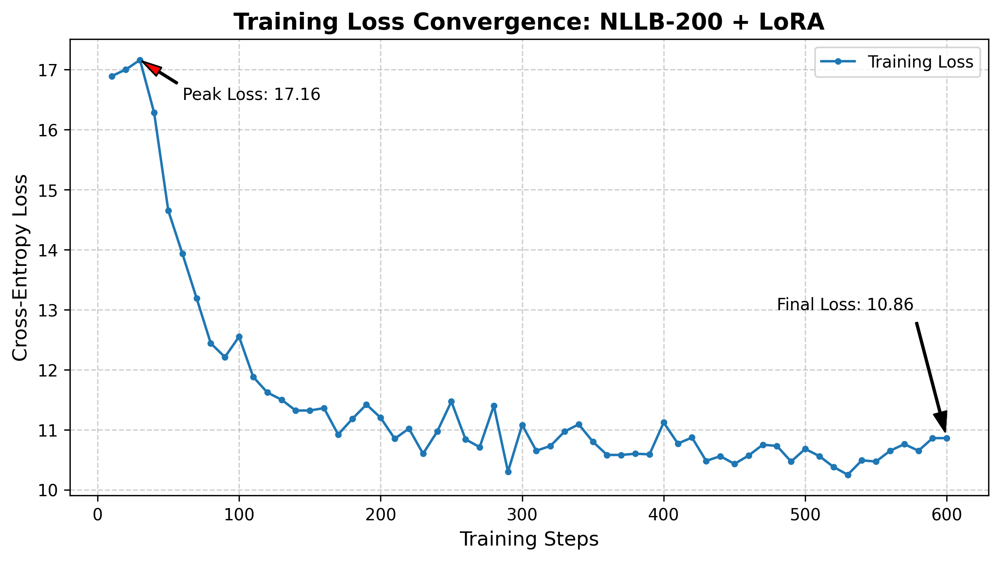

# 🇮🇳 Assamese-Kannada NMT via Parameter-Efficient Fine-Tuning (LoRA)

**An MTech Thesis Project demonstrating State-of-the-Art cross-family translation (Indo-Aryan to Dravidian) bypassing the shared-script Tokenization Barrier.**


---

## 📖 Abstract Overview
Direct translation between regional Indian languages typically suffers from extreme data sparsity and morphological divergence. Early multilingual baselines (like IndicBART) force regional alphabets into a shared phonetic space (the "Devanagari Trap"), destroying affixation boundaries and causing severe autoregressive decoding collapse. 

This repository solves this by applying **Low-Rank Adaptation (LoRA)** to the **NLLB-200** architecture. By preserving Separate Script (SS) tokenization, the model bridges Assamese and Kannada natively, achieving fluent translations in under 2 hours of training on consumer-grade hardware.

---

## 📊 Final Evaluation Metrics

Evaluated on a rigorously stratified 100-sentence Gold Standard test set, the model achieves exceptional character-level morphological mapping.

| Category | Linguistic Focus | BLEU Score | chrF++ Score |
| :--- | :--- | :---: | :---: |
| **I** | S-O-V Alignment & Basic Vocab | 9.78 | 55.14 |
| **II** | Post-positions & Case Markers | 28.49 | 59.59 |
| **III** | Honorifics & Pronoun Congruence | 51.63 | 68.79 |
| **IV** | Complex Tenses & Conditionals | 30.39 | 55.98 |
| **V** | Negation & Interrogatives | 43.76 | 68.54 |
| **Overall** | **Aggregate Gold Standard** | **32.92** | **60.80** |

---

## 📉 Training Convergence & The Baseline Failure

### The Baseline Failure (IndicBART)
An initial 8-hour full fine-tuning run on a standard sequence-to-sequence model plateaued at a 2.60 cross-entropy loss. However, it suffered catastrophic mode collapse due to shared-script morphological erasure, generating infinite loops of high-frequency Kannada syllables (e.g., `ನನನ ನನನ`).

### The LoRA Solution
By utilizing LoRA (Rank=16) on NLLB-200, we reduced trainable parameters by **99.42%**. The model avoided mode collapse completely and stabilized at a healthy loss of 10.86.


*(Ensure `loss_curve_complete.png` is uploaded to your repo for this image to render).*

---

## 🔍 Qualitative Case Study (Morphological Mapping)

The model successfully maps Assamese independent post-positions to Kannada's agglutinative suffixes. 

| Source (Assamese - Romanized) | Ground Truth (Kannada) | Model Prediction | Remark |
| :--- | :--- | :--- | :--- |
| Rame bhayekok eta kolom dile. | ರಾಮನು ತನ್ನ ಸಹೋದರನಿಗೆ ಒಂದು ಪೆನ್ನನ್ನು ಕೊಟ್ಟನು. | ರಾಮನು ತನ್ನ ಸಹೋದರನಿಗೆ ಒಂದು ಪೆನ್ನನ್ನು ಕೊಟ್ಟನು. | Perfect Dative Case alignment. |
| Sir, apuni bhitoroloi ahibo pare. | ಸರ್, ನೀವು ಒಳಗೆ ಬರಬಹುದು. | ಸರ್, ನೀವು ಒಳಗೆ ಬರಬಹುದು. | Maintained formal honorific congruence. |
| Jodi boroxun diye, tente moi najao. | ಮಳೆ ಬಂದರೆ, ನಾನು ಹೋಗುವುದಿಲ್ಲ. | ಮಳೆ ಬಂದರೆ, ನಾನು ಹೋಗುವುದಿಲ್ಲ. | Accurate conditional mapping. |

---

## 💻 Installation & Local CPU Inference

Because the LoRA adapters are extremely lightweight (~15MB), you can easily run inference on a standard non-GPU laptop.

**1. Install Dependencies:**
```bash
pip install torch transformers peft sentencepiece
